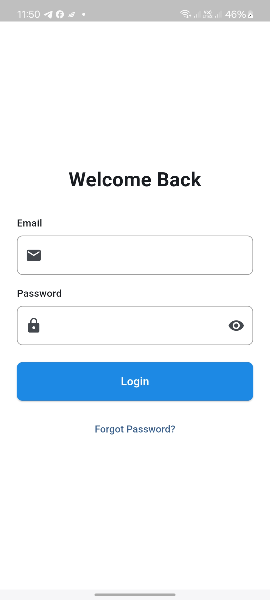
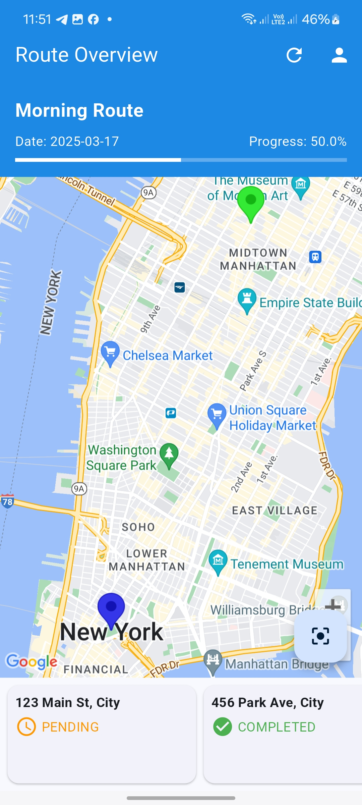
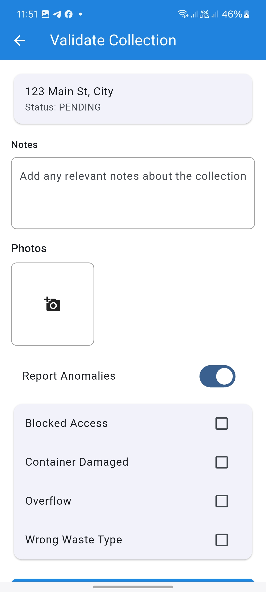
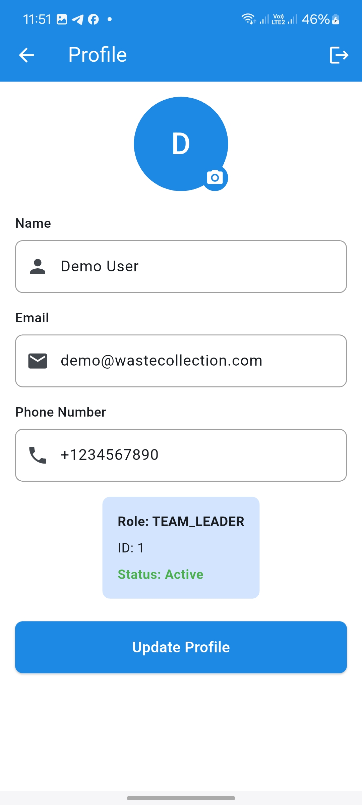

# Waste Collection Management System

## Project Overview

The Waste Collection Management System is designed to optimize waste collection by enabling companies to create, assign, and track routes in real-time while validating on-site collections. This project includes:

- A Flutter mobile app for the collection team and team leaders

## Screenshots






## Features

### Mobile App (Flutter)

#### Collection Team Space
- **Authentication**: Email/password login with password recovery
- **Profile Management**: Edit personal details
- **Daily Route Overview**: View assigned itinerary on an interactive map
- **Collection Validation**: Validate collection points using GPS capture & timestamp, report anomalies with comments/photos
- **Notifications**: Receive real-time alerts

#### Team Leader Space
- **Authentication**: Email/password login
- **Profile Management**: Edit personal details
- **Collection Management**: View & manage collection points, create/assign routes, and generate daily statistics
- **Team Management**: Create & modify team member profiles, monitor presence, track route history, and validate anomalies

## Technologies Used

- **Mobile App**: Flutter
- **Mapping Services**: Google Maps API
- **Notifications**: Firebase Cloud Messaging

## Installation

### Mobile App

1. Clone the repository:
    ```bash
    git clone https://github.com/yourusername/waste-collection-app.git
    cd waste-collection-app
    ```

2. Install dependencies:
    ```bash
    flutter pub get
    ```

3. Add your Google Maps API key to the `AndroidManifest.xml`:
    ```xml
    <meta-data
        android:name="com.google.android.geo.API_KEY"
        android:value="YOUR_API_KEY"/>
    ```

4. Run the app:
    ```bash
    flutter run
    ```


## Usage

### Mobile App

- **Login**: Use the provided email and password to log in.
- **Profile Management**: Update your personal details.
- **Route Overview**: View your assigned routes and collection points on the map.
- **Validate Collection**: Validate each collection point with GPS capture and report anomalies if any.
- **Notifications**: Receive real-time alerts for new routes and updates.


## License

This project is licensed under the MIT License - see the [LICENSE](LICENSE) file for details.

## Contact

For any inquiries or support, please contact us at [support@wastecollection.com](mailto:support@wastecollection.com).
